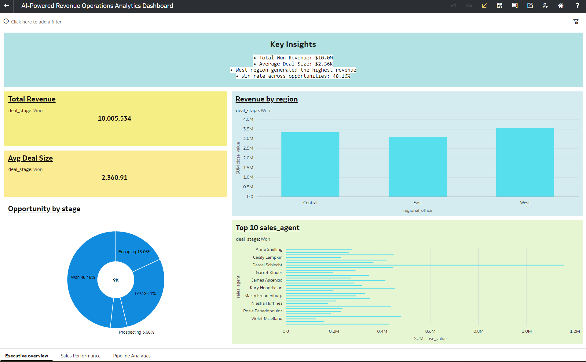
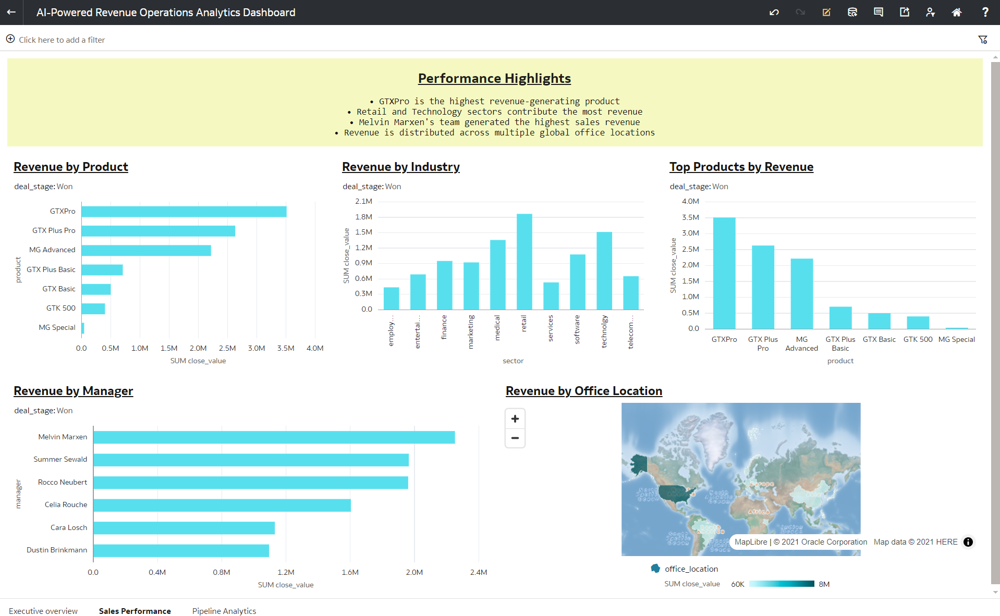
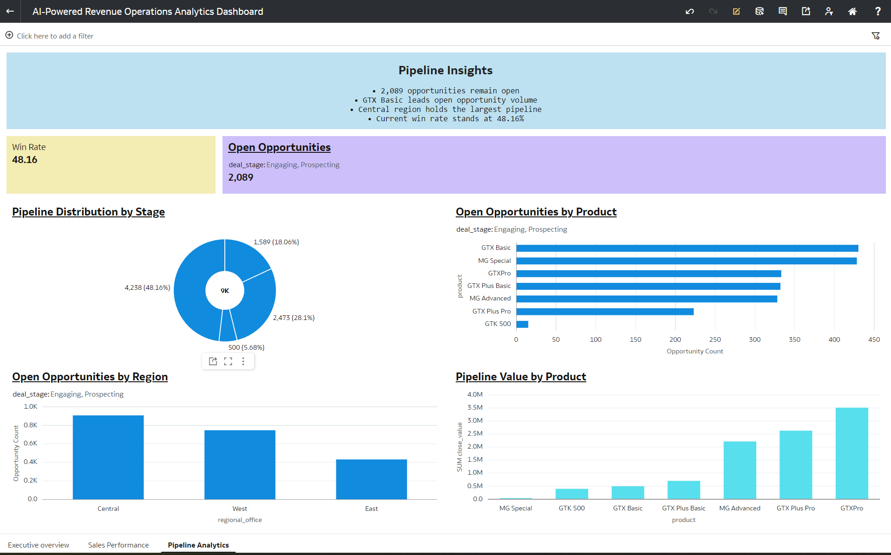

# AI-Powered Revenue Operations Analytics Dashboard

## Project Overview

This project demonstrates the development of an end-to-end Revenue Operations Analytics solution using SQL Server and Oracle Analytics Desktop.

The solution integrates sales opportunities, accounts, products, and sales team data to provide executive-level insights into revenue performance, sales effectiveness, pipeline health, and business growth opportunities.

## Technologies Used

- SQL Server
- T-SQL
- Oracle Analytics Desktop
- Data Modeling
- Business Intelligence
- Data Visualization

## Key Features

- Revenue Performance Analysis
- Sales Pipeline Analytics
- Win Rate Tracking
- Open Opportunity Monitoring
- Product Performance Analysis
- Regional Revenue Analysis
- Executive KPI Reporting

## Dashboard Pages

### Executive Overview
- Total Revenue
- Average Deal Size
- Revenue by Region
- Opportunity Distribution
- Top Sales Agents

### Sales Performance
- Revenue by Product
- Revenue by Industry
- Revenue by Manager
- Revenue by Office Location

### Pipeline Analytics
- Win Rate
- Open Opportunities
- Pipeline Distribution by Stage
- Open Opportunities by Product
- Open Opportunities by Region
- Pipeline Value by Product

## Dashboard Screenshots

### Executive Overview

### Sales Performance

### Pipeline Analytics

## Business Impact

This dashboard enables leadership teams to monitor revenue performance, identify growth opportunities, evaluate sales effectiveness, and make data-driven business decisions.
